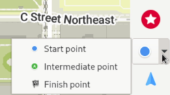
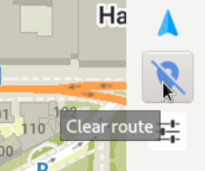
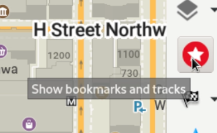

Om OM op Linux met flatpak te installeer, maak die terminale oop en voer `flatpak install flathub app.organicmaps.desktop` in

Sodra die toepassing geïnstalleer is, kan jy die rolwiel van jou muis of die kontroles op die regterkieslysbalk gebruik om in te zoem in die area wat jy wil navigeer om kaarte vir daardie area af te laai. Jy kan ook op die "aflaai"-ikoon regs onder klik. Sodra jy kaarte afgelaai het vir die streke waarvoor jy omgee, behoort die toepassing selfs sonder 'n internetverbinding te werk. 

Jy kan jou muis oor die verskillende ikone beweeg om hulpteks te sien. 

Om roetering en draai-vir-draai-navigasie uit te voer, het jy 'n paar opsies. as jy die GPS-koördinate van jou begin- en eindpunte ken, kan jy die instellingsikoon (bo die groen regmerkie) klik en die koördinate van jou beginpunt en bestemming invoer. Om die beginpunt op die kaart te stel, klik die navigasie-ikoon en kies "beginpunt", hou dan die shift-sleutel in en links-kliek op die kaart. Om die bestemming te stel, verander na "eindpunt" en klik 'n ligging op die kaart.

Jy kan die blou ikoon direk bokant instellingsikoon klik om navigasie skoon te maak. 

Om adresse en bestemmings te soek, klik op die vergrootglas en voer die adres of soekterm in.

Om 'n ligging te boekmerk, hou die Alt-sleutel in en klik met die rechtermuisknop op die plek wat jy wil boekmerk. Die boekmerk is dalk nie onmiddellik sigbaar nie, om boekmerke te sien en te bestuur moet jy op die rooi ster-ikoon klik. 

Die Linux-rekenaartoepassing word meestal vir ontwikkelingsdoeleindes gebruik (outomatiese toetsing en kontrolering van logika sonder om vir selfoon saam te stel). Enige vrywilligers om die bruikbaarheid van die Linux-weergawe te verbeter word verwelkom!
