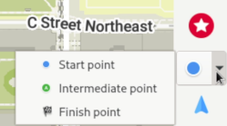

Az OM telepítéséhez Linuxra flatpak használatával, nyissa meg a terminált, és írja be a `flatpak install flathub app.organicmaps.desktop` parancsot.

Az alkalmazás telepítése után használhatja az egér görgőjét vagy a jobb oldali menüsorban lévő vezérlőket a navigálni kívánt területre nagyításhoz, hogy térképeket tölthessen le az adott területhez. A jobb alsó sarokban található "letöltés" ikonra is kattinthat. Miután letöltötte az Önnek fontos régiók térképeit, az alkalmazásnak internetkapcsolat nélkül is működnie kell. 

Ha az egeret a különböző ikonok fölé viszi, súgószövegeket szeretne látni. 

Az útvonaltervezéshez és a turn by turn navigációhoz több lehetőség közül választhat. Ha ismeri a kiindulási és végpont GPS-koordinátáit, kattintson a beállítások ikonra (a zöld pipa felett), és adja meg a kiindulási pont és az úti cél koordinátáit. A kiindulópont térképen történő beállításához kattintson a navigációs ikonra, és válassza ki a "kiindulópontot", majd tartsa lenyomva a Shift billentyűt, és kattintson a bal egérgombbal a térképre. A cél beállításához váltson „végpontra”, és kattintson egy helyre a térképen.

A navigáció törléséhez kattintson a kék ikonra közvetlenül a beállítások ikon felett. 

Címek és úti célok kereséséhez kattintson a nagyítóra, és írja be a címet vagy a keresett kifejezést.

Egy hely könyvjelzővel való megjelöléséhez tartsa lenyomva az Alt billentyűt, és kattintson a jobb gombbal arra a helyre, amelyet könyvjelzőként szeretne megjelölni. Előfordulhat, hogy a könyvjelző nem látható azonnal, a könyvjelzők megtekintéséhez és kezeléséhez kattintson a vörös csillag ikonra. 

A Linux asztali alkalmazást leginkább fejlesztési célokra használják (automatizált tesztelés és ellenőrzési logika anélkül, hogy mobilra kellene fordítani). Várunk minden önkéntest a Linux verzió használhatóságának javítására!
