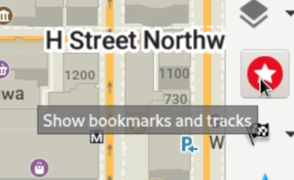

Untuk menginstal OM di Linux dengan flatpak, buka terminal dan masukkan `flatpak install flathub app.organicmaps.desktop`

Setelah aplikasi terinstal, Anda dapat menggunakan roda gulir mouse atau kontrol di bilah menu kanan untuk memperbesar area yang ingin Anda navigasi guna mengunduh peta untuk area tersebut. Anda juga dapat mengklik ikon "unduh" di kanan bawah. Setelah Anda mengunduh peta untuk wilayah yang Anda minati, aplikasi akan berfungsi bahkan tanpa koneksi internet. 

Anda dapat mengarahkan mouse ke berbagai ikon untuk melihat beberapa teks bantuan. 

Untuk melakukan perutean dan navigasi belokan demi belokan, Anda memiliki beberapa opsi. jika Anda mengetahui koordinat GPS titik awal dan akhir, Anda dapat mengklik ikon pengaturan (di atas tanda centang hijau) dan memasukkan koordinat titik awal dan tujuan Anda. Untuk menetapkan titik awal pada peta, klik ikon navigasi dan pilih "titik awal", lalu tahan tombol shift dan klik kiri pada peta. Untuk menetapkan tujuan, ubah ke "titik akhir" dan klik lokasi di peta.

Anda dapat mengklik ikon biru tepat di atas ikon pengaturan untuk menghapus navigasi. 

Untuk mencari alamat dan tujuan, klik kaca pembesar dan masukkan alamat atau istilah pencarian.

Untuk menandai suatu lokasi, tahan tombol Alt dan klik kanan tempat yang ingin Anda tandai. Bookmark mungkin tidak langsung terlihat, untuk melihat dan mengelola bookmark Anda perlu mengklik ikon bintang merah. 

Aplikasi desktop Linux sebagian besar digunakan untuk tujuan pengembangan (pengujian otomatis dan pemeriksaan logika tanpa harus dikompilasi untuk seluler). Setiap sukarelawan yang ingin meningkatkan kegunaan versi Linux dipersilakan!
