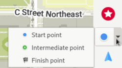
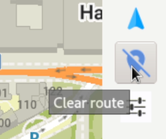
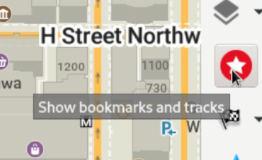

Linux に Flatpak で Organic Maps をインストールするには、ターミナルを開いて `flatpak install flathub app.organicmaps.desktop` と入力します。

アプリをインストールしたら、マウスのスクロールホイールや右側のメニューバーの操作ボタンを使って、移動したい地域を拡大し、その地域の地図をダウンロードできます。右下の「ダウンロード」アイコンをクリックしてもかまいません。必要な地域の地図をダウンロードしておけば、インターネットに接続していなくてもアプリは動作します。

各アイコンにマウスカーソルを合わせると、説明が表示されます。

ルート検索とターンバイターンのナビゲーションには、いくつかの方法があります。出発地と目的地の GPS 座標が分かっている場合は、設定アイコン（緑のチェックマークの上）をクリックし、出発地と目的地の座標を入力します。地図上で出発地を設定するには、ナビゲーションアイコンをクリックして「出発地」を選び、Shift キーを押しながら地図上を左クリックします。目的地を設定するには「目的地」に切り替えて、地図上の場所をクリックします。

設定アイコンのすぐ上にある青いアイコンをクリックすると、ナビゲーションを解除できます。

住所や目的地を検索するには、虫眼鏡のアイコンをクリックして、住所や検索語を入力します。

場所をブックマークするには、Alt キーを押しながら、ブックマークしたい場所を右クリックします。ブックマークはすぐには表示されないことがあります。ブックマークを表示・管理するには、赤い星のアイコンをクリックしてください。

Linux 版のデスクトップアプリは、主に開発目的（モバイル向けにビルドせずに自動テストやロジックの確認を行うため）で使われています。Linux 版の使い勝手を良くしてくださるボランティアを歓迎します！
