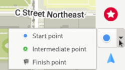
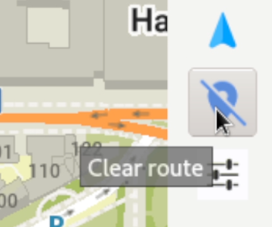
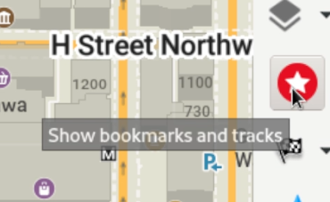

Para instalar o OM no Linux com flatpak, abre o terminal e insere `flatpak install flathub app.organicmaps.desktop`

Depois que o aplicativo estiver instalado, podes usar a roda de rolagem do mouse ou os controles na barra de menu direita para ampliar a área que desejas navegar e baixar mapas para essa área. Também podes clicar no ícone “download” no canto inferior direito. Depois de baixar os mapas das regiões do teu interesse, o aplicativo deverá funcionar mesmo sem conexão com a Internet. 

Podes passar o mouse sobre os vários ícones para ver algum texto de ajuda. 

Para realizar roteamento e navegação passo a passo, tens algumas opções. se conheces as coordenadas GPS dos teus pontos inicial e final, podes clicar no ícone de configurações (acima da marca de seleção verde) e inserir as coordenadas do teu ponto inicial e destino. Para definir o ponto inicial no mapa, clica no ícone de navegação e seleciona «ponto inicial», mantém pressionada a tecla Shift e clica com o botão esquerdo no mapa. Para definir o destino, muda para “ponto final” e clica em um local no mapa.

Podes clicar no ícone azul diretamente acima do ícone de configurações para limpar a navegação. 

Para pesquisar endereços e destinos, clica na lupa e digita o endereço ou termo de pesquisa.

Para marcar um local, mantém pressionada a tecla Alt e clica com o botão direito no local que desejas marcar. O marcador pode não estar imediatamente visível. Para visualizar e gerenciar os marcadores, precisas clicar no ícone de estrela vermelha. 

O aplicativo de desktop Linux é usado principalmente para fins de desenvolvimento (teste automatizado e verificação de lógica sem a necessidade de compilar para dispositivos móveis). Quaisquer voluntários para melhorar a usabilidade da versão Linux são bem-vindos!
