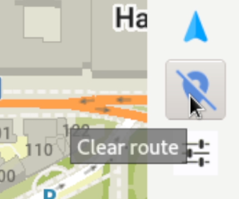

Чтобы установить OM в Linux с помощью Flatpak, откройте терминал и введите «flatpak install Flathub app.organicmaps.desktop».

После установки приложения вы можете использовать колесо прокрутки мыши или элементы управления в правой строке меню, чтобы увеличить масштаб области, по которой вы хотите перемещаться, и загрузить карты для этой области. Вы также можете нажать кнопку «Загрузить» в правом нижнем углу. После того, как вы загрузите карты интересующих вас регионов, приложение должно работать даже без подключения к Интернету.

Вы можете навести указатель мыши на различные значки, чтобы увидеть текст справки.

Для построения маршрутов и пошаговой навигации у вас есть несколько вариантов. Если вы знаете координаты GPS начальной и конечной точек, можно щёлкнуть иконку настроек (над зеленой галочкой) и ввести координаты начальной точки и пункта назначения. Чтобы установить начальную точку на карте, щёлкните иконку навигации и выберите «Начальная точка», затем, удерживая клавишу Shift, щёлкните левой кнопкой мыши по карте. Чтобы установить пункт назначения, измените значение на «конечную точку» и щёлкните местоположение на карте.

Вы можете щёлкнуть синюю кнопку прямо над иконкой настроек, чтобы очистить навигацию.

Для поиска адресов и пунктов назначения щёлкните увеличительное стекло и введите адрес или поисковый запрос.

Чтобы создать метку для места, удерживайте клавишу Alt и щёлкните правой кнопкой мыши место, для которого вы хотите создать метку. Метка может быть видна не сразу, для просмотра и управления метками необходимо нажать значок красной звездочки.

Настольное приложение Linux в основном используется в целях разработки (автоматическое тестирование и проверка логики без необходимости компиляции для мобильных устройств). Приветствуются любые добровольцы, желающие улучшить удобство использования версии Linux!
