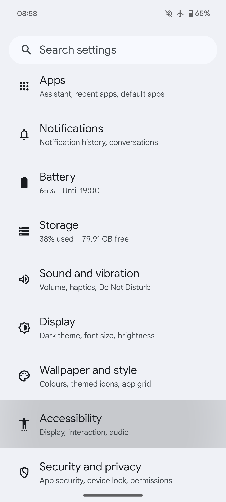
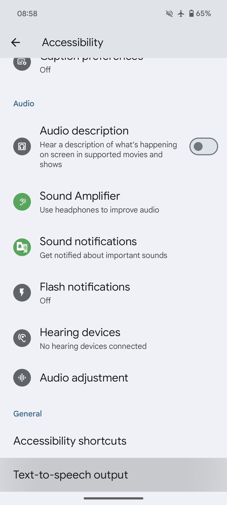
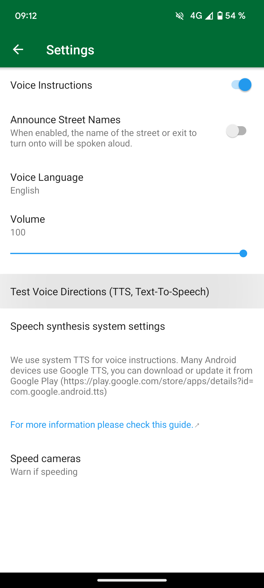

## Zusammenfassung

Organic Maps nutzt die TTS-Engine (Text-zu-Sprache) des Systems für Sprachanweisungen. Die Standard-Engines variieren je nach Gerät. Zur Auswahl stehen Google Text-to-Speech, die Engine des Geräteherstellers oder die Engine eines Drittanbieters.

Die offizielle Empfehlung von Organic Maps ist [RHVoice](https://rhvoice.org/), eine kostenlose Open-Source-Sprach-Engine, die von [Google Play](https://play.google.com/store/apps/details?id=com.github.olga_yakovleva.rhvoice.android) heruntergeladen werden kann [F-Droid](https://f-droid.org/en/packages/com.github.olga_yakovleva.rhvoice.android/).

## Anleitung

- Öffne die Einstellungen-App auf deinem Android-Gerät
- Wähle "Allgemeine Verwaltung" und dann "Text-zu-Sprache"
- Wähle deine bevorzugte Engine, Sprechgeschwindigkeit und Tonhöhe
- **Organic Maps neu starten**
- Öffnen in Organic Maps Einstellungen => "Sprachanweisungen" und konfiguriere es
- Starte Organic Maps erneut (oder starte das Gerät neu), wenn die Sprachanweisungen nicht funktionieren

Wenn du die entsprechende Einstellung nicht finden kannst, öffne die Einstellungs-App und suche nach Sprachausgabe/Text-zu-Sprache.

P.S.: Beachte, dass diese Schritte je nach Hersteller deines Geräts variieren können.

Diese Optionen werden möglicherweise nicht angezeigt, wenn auf deinem Gerät noch keine TTS-Engine (Text-zu-Sprache) installiert ist. Bitte nutzen die Tabelle unten, um eine TTS-Engine zu finden, die deine Muttersprache unterstützt.

## Screenshots

|             |             |
| ----------- | ----------- |
 | 

## Engines {#engines}

Nachfolgend findest du eine umfassende Liste mit mehreren Engines und den von ihnen unterstützten Sprachen (Download-Links finden Sie nach der Tabelle):

{{ tts_table() }}

## Problemumgehungen

Wenn du Probleme beim Initialisieren der RHVoice TTS-Engine unter LineageOS oder anderen benutzerdefinierten ROMs hast, versuche folgenden Problemumgehung. RHVoice wird möglicherweise nicht ordnungsgemäß initialisiert und die App kann abstürzen, insbesondere wenn du zuvor noch keine TTS-Engine auf deinem Telefon verwendet hast (z. B. Neuinstallation, Zurücksetzen auf Werkseinstellungen, usw.). Wenn du eine benutzerdefinierte ROM wie LineageOS <ins>ohne Google Play-Dienste und Sprachdienste von Google</ins> verwendest und RHVoice als deine bevorzugte TTS-Engine verwenden möchtest, befolge als Workaround die folgenden Anweisungen:

1. Installiere die [eSpeak TTS-Engine](https://f-droid.org/en/packages/com.reecedunn.espeak), die auf F-Droid verfügbar ist
2. Lege es als bevorzugte System-Engine fest
    - Gehe zu den LineageOS-**Haupteinstellungen**.
    - Scrolle nach unten zu **Barrierefreiheit**.
    - Wähle **Text-to-Speech-Ausgabe** und **Bevorzugte Engine** (linke Seite) und stelle sicher, dass **eSpeak** ausgewählt ist.
3. Gehe zurück und drücke **Play**, um zu sehen, ob es funktioniert
4. Installiere [RHVoice](https://f-droid.org/en/packages/com.github.olga_yakovleva.rhvoice.android/), verfügbar auf F-droid.
    - Öffne es, wähle die Sprache aus, die du verwenden möchtest, und tippe auf das Cloud-Symbol (ganz links), um Stimmen herunterzuladen.
    - Drücke die Wiedergabetaste, um zu überprüfen, ob es funktioniert
5. **RHVoice** als bevorzugte Engine festlegen (siehe Schritt 2)
6. Nun solltest du RHVoice problemlos nutzen können

## Testen

Um die Sprachanweisungen zu testen, kannst du im OM-Menü „Einstellungen → Sprachanweisungen“ auf „Sprachanweisungen testen (TTS, Text-zu-Sprache)“ tippen oder tatsächlich eine Navigation starten, um eine beliebige Sprachausgabe zu erhalten. Organic Maps gibt dir im Stillstand keine Sprachanweisungen.

