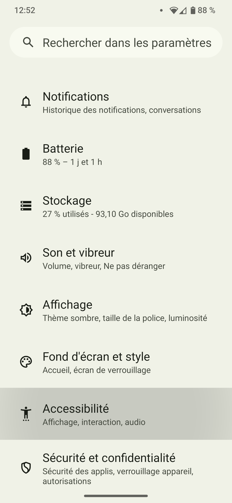
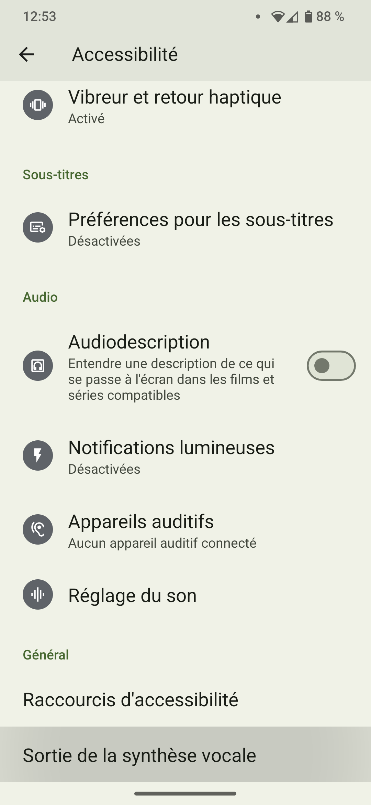
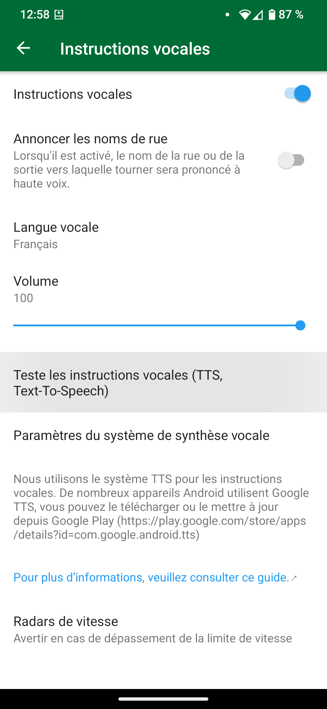

## Sommaire

Organic Maps utilise le moteur de synthèse vocale du système pour les instructions vocales. Les moteurs par défaut varient selon les appareils. Il peut s'agir de Google Text-to Speech, du moteur du fabricant de l'appareil ou d'un moteur tiers.

La recommandation officielle d'Organic Maps est [RHVoice](https://rhvoice.org/), qui est un moteur vocal libre et gratuit pouvant être téléchargé sur le [Google Play](https://play.google.com/store/apps/details?id=com.github.olga_yakovleva.rhvoice.android) et [F-Droid](https://f-droid.org/en/packages/com.github.olga_yakovleva.rhvoice.android/).

## Instructions

- Ouvre l'application Paramètres sur ton appareil Android
- Sélectionne Paramètres supplémentaires, puis Accessibilité
- Choisis ton moteur, la vitesse d'élocution et la tonalité
- **Redémarre l'application Organic Maps**
- Ouvre Paramètres => Instructions vocales dans Organic Maps et configure-les.
- Redémarre l'application Organic Maps (ou redémarre l'appareil) si la voix ne fonctionne pas.

Si tu ne trouves pas le paramètre approprié, ouvre l'application Paramètres et recherche Text-to-speech.

P.S : Note que ces étapes varient en fonction de la marque du téléphone que tu utilises.

Ces options peuvent ne pas apparaître si aucun TTS n'est installé sur ton appareil. Reporte-toi au tableau ci-dessous pour installer l'un d'entre eux qui prend en charge ta langue maternelle.

## Captures d'écran

|             |             |
| ----------- | ----------- |
 | 

## Moteurs de synthèse vocale {#engines}

Tu trouveras ci-dessous une liste de plusieurs langues et moteurs et supportées (les liens de téléchargement se trouvent après le tableau) :

{{ tts_table() }}

## Solutions alternatives

Si tu as des difficultés à initialiser le moteur TTS de RHVoice sur LineageOS ou d'autres ROMs personnalisées, essaie cette solution alternative. RHVoice peut ne pas s'initialiser correctement et l'application peut se bloquer, en particulier si tu n'as jamais utilisé de moteur de synthèse vocale sur ton téléphone (nouvelle installation, réinitialisation d'usine, etc.). Si tu utilises une ROM personnalisée comme LineageOS <ins>sans les services Google Play et Speech Services by Google</ins>, et que tu souhaites utiliser RHVoice comme moteur TTS préféré, suis les instructions ci-dessous comme solution de contournement :

1. Installe le [moteur eSpeak TTS](https://f-droid.org/en/packages/com.reecedunn.espeak) disponible sur F-Droid
2. Définis le comme le moteur préféré du système
    - Va dans les **Paramètres** de LineageOS.
    - Descends jusqu'à **Accessibilité**.
    - Sélectionne **Sortie de la synthèse vocale** et **Moteur préféré** (à gauche) et assure-toi que **eSpeak** est sélectionné.
3. Reviens en arrière et appuie sur **Lire** pour vérifier que cela fonctionne.
4. Installe [RHVoice](https://f-droid.org/en/packages/com.github.olga_yakovleva.rhvoice.android/) disponible sur F-droid.
    - Ouvre l'application, sélectionne la langue que tu souhaites utiliser et appuie sur l'icône du nuage (à gauche) pour télécharger les voix.
    - Appuie sur le bouton de lecture pour vérifier qu'il fonctionne
5. Définis **RHVoice** comme moteur préféré (voir étape 2)
6. Tu devrais maintenant pouvoir utiliser RHVoice sans problème.

## Tests

Pour tester les instructions vocales, tu peux cliquer sur «Tester les instructions vocales (TTS, Text-To-Speech)» dans le menu OM «Paramètres → Instructions vocales» ou tu peux démarrer la navigation pour entendre des instructions vocales. Organic Maps ne te donnera pas d'instructions vocales tant que tu es à l'arrêt.

