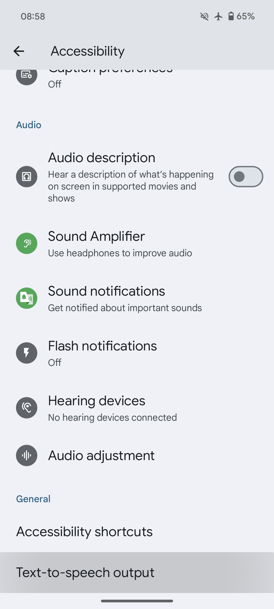

## סיכום

Organic Maps משתמשת במנוע הטקסט-לדיבור (TTS) של המערכת להוראות קוליות. מנועי ברירת המחדל משתנים ממכשיר למכשיר. הבחירות יכולות לכלול את Google Text-to Speech, מנוע של יצרן המכשיר או צד שלישי.
ההמלצה הרשמית מ-Organic Maps היא [RHVoice](https://rhvoice.org/), שהיא מנוע דיבור חופשי ובקוד פתוח שניתן להוריד מ-[Google Play](https://play.google.com/store/apps/details?id=com.github.olga_yakovleva.rhvoice.android) ו-[F-Droid](https://f-droid.org/en/packages/com.github.olga_yakovleva.rhvoice.android/).

## הוראות

- פתחו את אפליקציית ההגדרות במכשיר האנדרואיד שלכם
- בחרו הגדרות נוספות (Additional Settings) ואז בחרו נגישות (Accessibility)
- בחרו את המנוע המועדף עליכם, קצב הדיבור והגובה
- **הפעילו מחדש את אפליקציית Organic Maps**
- פתחו הגדרות => הוראות קוליות ב-Organic Maps והגדירו זאת
- הפעילו מחדש את אפליקציית Organic Maps שוב (או אתחלו את המכשיר) אם הקול לא עובד

אם אינכם מוצאים את ההגדרה הרלוונטית, פתחו את אפליקציית ההגדרות וחפשו Text-to-speech.

נ.ב: שימו לב וצעדים אלה ישתנו בהתאם למותג הטלפון בו אתם משתמשים.
האפשרויות האמורות עשויות שלא להופיע אם אין לכם TTS מותקן כבר במכשיר. אנא עיינו בטבלה למטה להתקנת אחד התומך בשפת האם שלכם.

## צילומי מסך

|             |             |
| ----------- | ----------- |
 | 

## מנועים {#engines}
להלן רשימה מקיפה המציגה מספר מנועים והשפות בהן הם תומכים:
{{ tts_table() }}

## בדיקה
כדי לבדוק את ההוראות הקוליות, אתם יכולים להקיש על "Test Voice Directions (TTS, Text-To-Speech)" בתפריט "הגדרות → הוראות קוליות" ב-OM או שאתם יכולים להתחיל ניווט בפועל לקבלת פלט קולי כלשהו. Organic Maps לא תיתן לכם הוראות קוליות בזמן שאתם עומדים במקום.

