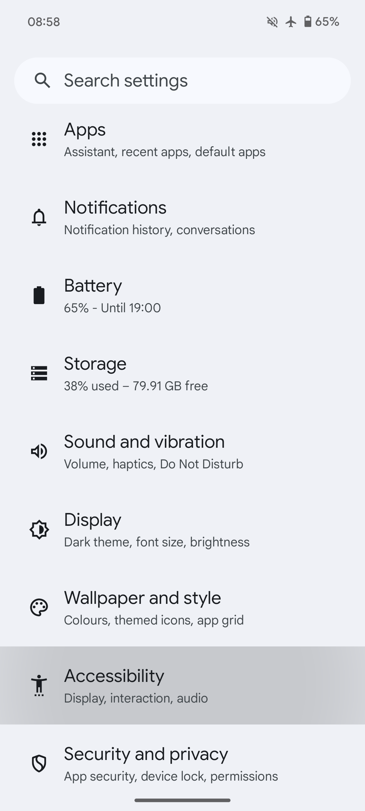
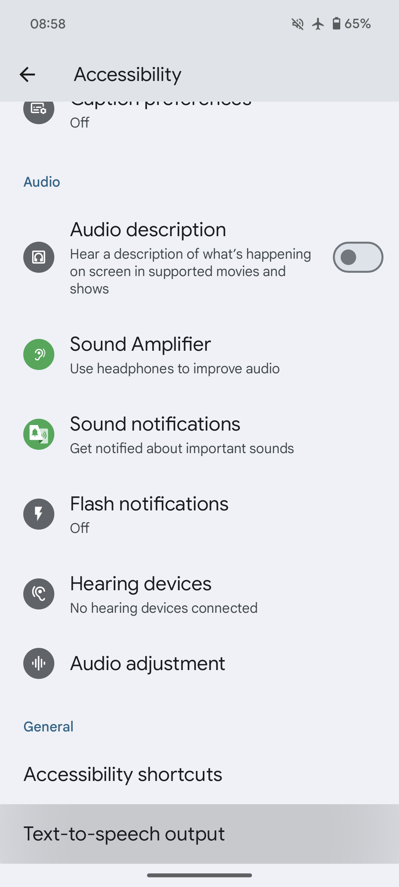
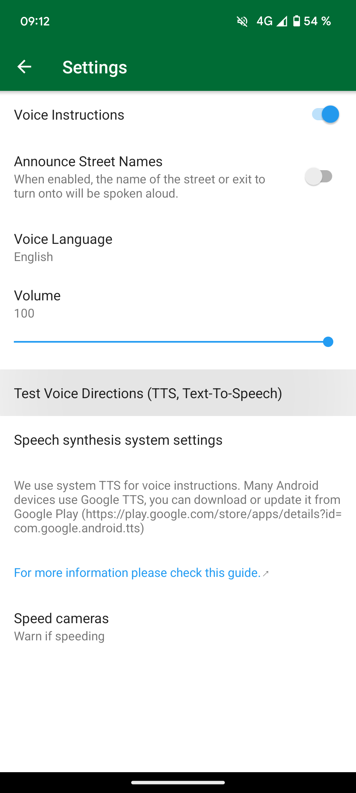

## 概要

Organic Maps は、音声案内にシステムのテキスト読み上げ（TTS）エンジンを使います。既定のエンジンは端末によって異なり、Google Text-to-Speech、端末メーカー製のエンジン、サードパーティ製のエンジンなどが選べます。

Organic Maps が公式におすすめしているのは [RHVoice](https://rhvoice.org/) です。これは無料でオープンソースの音声エンジンで、[Google Play](https://play.google.com/store/apps/details?id=com.github.olga_yakovleva.rhvoice.android) と [F-Droid](https://f-droid.org/en/packages/com.github.olga_yakovleva.rhvoice.android/) からダウンロードできます。

## 手順

- Android 端末で「設定」アプリを開きます
- 「その他の設定」を選び、続いて「ユーザー補助」を選びます
- 好みのエンジン、読み上げ速度、声の高さを選びます
- **Organic Maps アプリを再起動します**
- Organic Maps で「設定」→「音声指示」を開いて設定します
- 音声が出ない場合は、Organic Maps アプリをもう一度再起動します（または端末を再起動します）

該当する設定が見つからない場合は、設定アプリを開いて「テキスト読み上げ」を検索してください。

追伸：これらの手順は、お使いのスマートフォンのメーカーによって異なりますのでご注意ください。

端末に TTS がまだインストールされていない場合、これらの項目は表示されないことがあります。下の表を参考に、お使いの言語に対応したものをいずれかインストールしてください。

## スクリーンショット

|             |             |
| ----------- | ----------- |
 | 

## エンジン {#engines}

いくつかのエンジンと、それぞれが対応する言語をまとめた一覧です（ダウンロードリンクは表のあとにあります）。

{{ <tts_table lang /> }}

## 回避策

LineageOS などのカスタム ROM で RHVoice TTS エンジンの初期化がうまくいかない場合は、次の回避策を試してください。特に、その端末でこれまで TTS エンジンを使ったことがない場合（新規インストールや初期化の直後など）、RHVoice が正しく初期化されず、アプリがクラッシュすることがあります。<ins>Google Play 開発者サービスと Speech Services by Google が入っていない</ins> LineageOS のようなカスタム ROM を使っていて、RHVoice を優先エンジンにしたい場合は、次の手順を回避策としてお試しください。

1. F-Droid で配布されている [eSpeak TTS エンジン](https://f-droid.org/en/packages/com.reecedunn.espeak)をインストールします
2. これをシステムの優先エンジンに設定します
    - LineageOS の**設定**を開きます。
    - **ユーザー補助**まで画面をスクロールします。
    - **テキスト読み上げの出力**と**優先エンジン**（左側）を選び、**eSpeak** が選択されていることを確認します。
3. 前の画面に戻り、**再生**を押して動作するか確認します
4. F-Droid で配布されている [RHVoice](https://f-droid.org/en/packages/com.github.olga_yakovleva.rhvoice.android/) をインストールします。
    - アプリを開き、使いたい言語を選び、クラウドのアイコン（左端）をタップして音声をダウンロードします。
    - 再生ボタンを押して、動作するか確認します
5. **RHVoice** を優先エンジンに設定します（手順 2 を参照）
6. これで RHVoice を問題なく使えるはずです

## テスト

音声案内をテストするには、Organic Maps の「設定 → 音声指示」メニューで「音声案内をテストする（TTS、Text-To-Speech）」をタップするか、実際にナビゲーションを開始して音声が流れるかどうかを確認します。Organic Maps は、止まっている間は音声案内を行いません。

