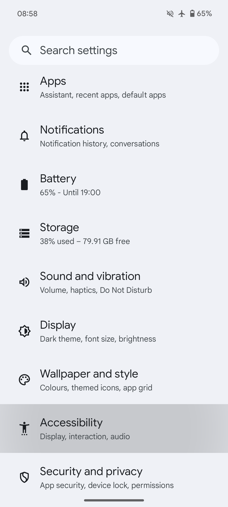
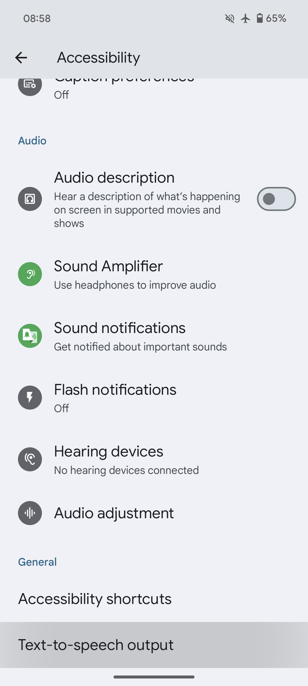
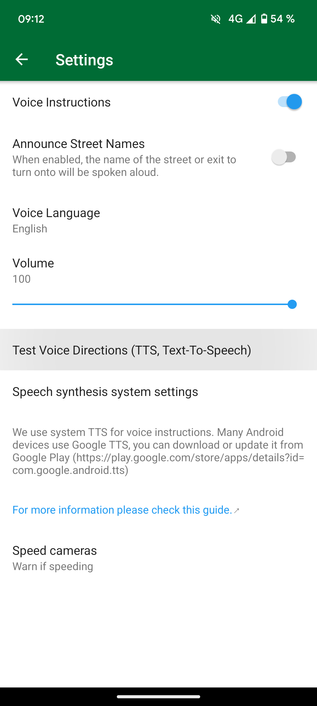

## Samenvatting

Organic Maps gebruikt de tekst-naar-spraak-engine (TTS) van het systeem voor gesproken instructies. De standaardengines variëren per apparaat. De keuzes kunnen bestaan ​​uit Google Text-to Speech, de engine van de apparaatfabrikant of een engine van derden.

De officiële aanbeveling van Organic Maps is [RHVoice](https://rhvoice.org/), een gratis en open source spraakengine die kan worden gedownload van [Google Play](https://play.google.com/store/apps/details?id=com.github.olga_yakovleva.rhvoice.android) en [F-Droid](https://f-droid.org/en/packages/com.github.olga_yakovleva.rhvoice.android/).

## Instructies

- Open de app Instellingen op je Android-apparaat
- Selecteer Aanvullende instellingen en selecteer vervolgens Toegankelijkheid
- Kies de gewenste engine, spreeksnelheid en toonhoogte
- **Start de Organic Maps-app opnieuw**
- Open Instellingen => Gesproken instructies in Organic Maps en stel het in
- Start de Organic Maps-app opnieuw (of start het apparaat opnieuw op) als de stem niet werkt

Als je de relevante instelling niet kunt vinden, open je de instellingen-app en zoek je naar Tekst-naar-spraak.

P.S: Houd er rekening mee dat deze stappen variëren, afhankelijk van het telefoonmerk dat je gebruikt.

Deze opties verschijnen mogelijk niet als er nog geen TTS op je apparaat is geïnstalleerd. Raadpleeg de onderstaande tabel om een ​​van deze programma's te installeren die je moedertaal ondersteunen.

## Schermafbeeldingen

|             |             |
| ----------- | ----------- |
 | 

## Motoren {#motoren}

Hieronder vind je een uitgebreide lijst met verschillende zoekmachines en de talen die ze ondersteunen (downloadlinks vind je na de tabel):

{{ tts_table() }}

## Oplossingen

Probeer deze oplossing als je problemen ondervindt bij het initialiseren van de RHVoice TTS-engine op LineageOS of andere aangepaste ROM's. RHVoice wordt mogelijk niet correct geïnitialiseerd en de app kan crashen, vooral als je nog niet eerder een TTS-engine op je telefoon hebt gebruikt (bijvoorbeeld nieuwe installatie, fabrieksreset, enz.). Als je een aangepast ROM zoals LineageOS <ins>zonder Google Play-services en spraakservices van Google</ins> gebruikt en je RHVoice als je favoriete TTS-engine wilt gebruiken, volg je de onderstaande instructies als tijdelijke oplossing:

1. Installeer de [eSpeak TTS-engine](https://f-droid.org/en/packages/com.reecedunn.espeak) beschikbaar op F-Droid
2. Stel het in als de voorkeurssysteemengine
    - Ga naar LineageOS hoofd **Instellingen**.
    - Scroll naar beneden naar **Toegankelijkheid**.
    - Selecteer **tekst-naar-spraakuitvoer** en **Voorkeursengine** (linkerkant) en zorg ervoor dat **eSpeak** is geselecteerd.
3. Ga terug en druk op **play** om te zien of het werkt
4. Installeer [RHVoice](https://f-droid.org/en/packages/com.github.olga_yakovleva.rhvoice.android/) beschikbaar op F-droid.
    - Open het, selecteer de taal die je wilt gebruiken, tik op het cloudpictogram (uiterst links) om stemmen te downloaden.
    - Druk op de afspeelknop om te controleren of deze werkt
5. Stel **RHVoice** in als voorkeursmotor (zie stap 2)
6. Nu zou je RHVoice zonder problemen moeten kunnen gebruiken

## Testen

Om de gesproken instructies te testen, kun je tikken op "Test stemaanwijzingen (TTS, tekst-naar-spraak)" in het OM-menu "Instellingen → Gesproken instructies" of je kunt daadwerkelijk een navigatie starten om stemuitvoer te ontvangen. Organic Maps geeft je geen gesproken instructies terwijl je stilstaat.

