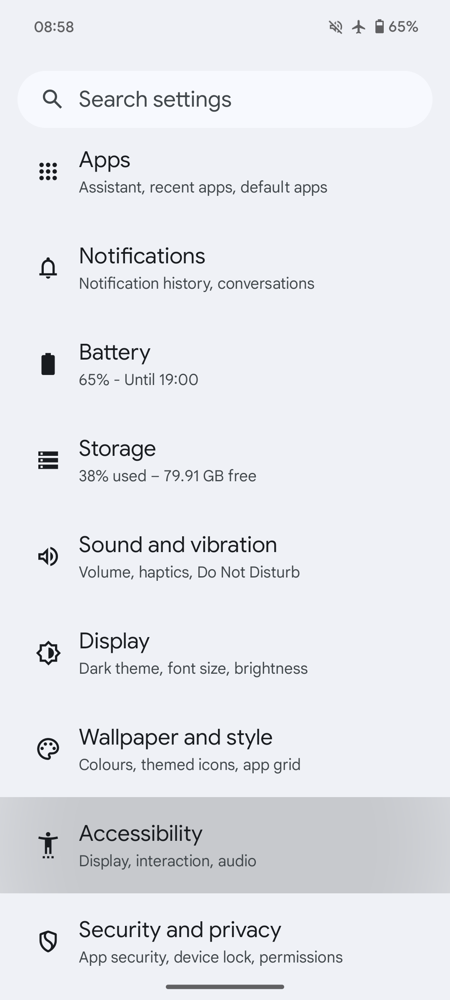

## Podsumowanie

Organiczne Mapy korzystają z systemowego mechanizmu zamiany tekstu na mowę (TTS) do obsługi instrukcji głosowych. Domyślne silniki różnią się w zależności od urządzenia. Dostępne opcje obejmują funkcję zamiany tekstu na mowę Google, silnik producenta urządzenia lub silnik innej firmy.

Oficjalna rekomendacja Organic Maps to [RHVoice](https://rhvoice.org/), czyli darmowy silnik mowy o otwartym kodzie źródłowym, który można pobrać z [Google Play](https://play.google.com/store/apps/details?id=com.github.olga_yakovleva.rhvoice.android) i [F-Droid](https://f-droid.org/en/packages/com.github.olga_yakovleva.rhvoice.android/).

## Instrukcje

- Otwórz aplikację Ustawienia na urządzeniu z Androidem
- Wybierz opcję Ustawienia dodatkowe, a następnie opcję Dostępność
- Wybierz preferowany silnik, tempo mowy i ton
- **Uruchom ponownie aplikację Mapy organiczne**
- Otwórz Ustawienia => Instrukcje głosowe w organicznych mapach i skonfiguruj
- Uruchom ponownie aplikację Organic Maps ponownie (lub zrestartuj urządzenie), jeśli głos nie działa

Jeśli nie możesz znaleźć odpowiedniego ustawienia, otwórz aplikację ustawień i wyszukaj opcję zamiany tekstu na mowę.

PS: Pamiętaj, że te kroki będą się różnić w zależności od marki telefonu, z którego korzystasz.

Wspomniane opcje mogą się nie pojawić, jeśli nie masz jeszcze zainstalowanego TTS na swoim urządzeniu. Aby zainstalować dowolny z nich, który obsługuje Twój język ojczysty, zapoznaj się z poniższą tabelą.

## Zrzuty ekranu

|             |             |
| ----------- | ----------- |
 | 

## Silniki {#silniki}

Poniżej znajduje się obszerna lista pokazująca kilka silników i obsługiwane przez nie języki (linki do pobrania znajdują się pod tabelą):

{{ tts_table() }}

## Obejścia

Jeśli masz problemy z inicjalizacją silnika RHVoice TTS w systemie LineageOS lub innych niestandardowych pamięciach ROM, wypróbuj to obejście. RHVoice może nie zostać poprawnie zainicjowany, a aplikacja może ulec awarii, szczególnie jeśli nie korzystałeś wcześniej z żadnego silnika TTS w telefonie (np. nowa instalacja, reset do ustawień fabrycznych itp.). Jeśli używasz niestandardowej pamięci ROM, takiej jak LineageOS <ins>bez usług Google Play i usług mowy Google</ins>, i chcesz używać RHVoice jako preferowanego silnika TTS, wykonaj poniższe instrukcje jako obejście:

1. Zainstaluj [silnik eSpeak TTS] (https://f-droid.org/en/packages/com.reecedunn.espeak) dostępny na F-Droid
2. Ustaw go jako preferowany silnik systemowy
    - Przejdź do głównych **Ustawień** LineageOS.
    - Przewiń w dół do **Dostępność**.
    - Wybierz **przetwarzanie tekstu na mowę** i **Preferowany silnik** (lewa strona) i upewnij się, że wybrano **eSpeak**.
3. Wróć i naciśnij **odtwórz**, aby sprawdzić, czy działa
4. Zainstaluj [RHVoice](https://f-droid.org/en/packages/com.github.olga_yakovleva.rhvoice.android/) dostępny na F-droid.
    - Otwórz, wybierz język, którego chcesz używać, dotknij ikony chmury (po lewej stronie), aby pobrać głosy.
    - Naciśnij przycisk odtwarzania, aby sprawdzić, czy działa
5. Ustaw **RHVoice** jako preferowany silnik (patrz krok 2)
6. Teraz powinieneś móc korzystać z RHVoice bez żadnych problemów

## Testowanie

Aby przetestować instrukcje głosowe, możesz dotknąć „Testuj wskazówki głosowe (TTS, zamiana tekstu na mowę)” w menu OM „Ustawienia → Instrukcje głosowe” lub możesz rozpocząć nawigację, aby otrzymać dowolny sygnał głosowy. Mapy organiczne nie będą podawać żadnych instrukcji głosowych, gdy stoisz w miejscu.

