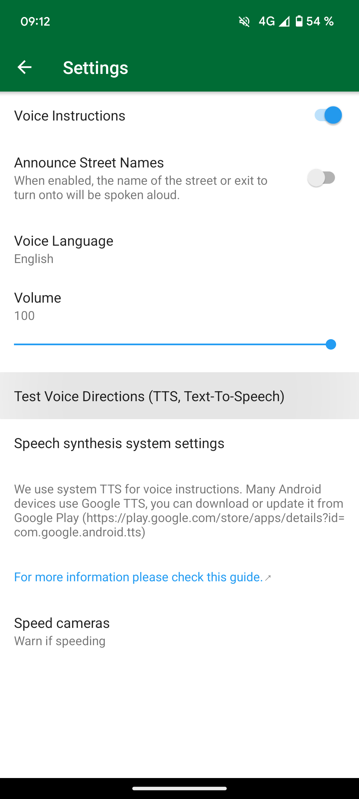

## Resumo

Organic Maps usa o mecanismo de conversão de texto em fala (TTS) do sistema para instruções de voz. Os mecanismos padrão variam de acordo com o dispositivo. As opções podem incluir Google Text-to Speech, mecanismo do fabricante do dispositivo ou de terceiros.

A recomendação oficial do Organic Maps é [RHVoice](https://rhvoice.org/), que é um mecanismo de fala gratuito e de código aberto que pode ser baixado do [Google Play](https://play.google.com/store/apps/details?id=com.github.olga_yakovleva.rhvoice.android) e [F-Droid](https://f-droid.org/en/packages/com.github.olga_yakovleva.rhvoice.android/).

## Instruções

- Abra o aplicativo Configurações no seu dispositivo Android
- Selecione Configurações adicionais e selecione Acessibilidade
- Escolha seu mecanismo, velocidade de fala e tom preferidos
- **Reinicie o aplicativo Organic Maps**
- Abra Configurações => Instruções de voz em mapas orgânicos e configure-o
- Reinicie o aplicativo Organic Maps novamente (ou reinicie o dispositivo) se a voz não estiver funcionando

Se você não conseguir encontrar a configuração relevante, abra o aplicativo de configurações e pesquise Text-to-speech.

P.S: Observe que essas etapas variam de acordo com a marca do telefone que você está usando.

Essas opções podem não aparecer se você ainda não tiver um TTS instalado no seu dispositivo. Consulte a tabela abaixo para instalar qualquer um deles que suporte seu idioma nativo.

## Capturas de tela

|             |             |
| ----------- | ----------- |
 | 

## Motores {#motores}

Abaixo está uma lista abrangente mostrando vários mecanismos e os idiomas que eles suportam (links para download podem ser encontrados após a tabela):

{{ tts_table() }}

## Soluções alternativas

Se você estiver tendo problemas para inicializar o mecanismo RHVoice TTS no LineageOS ou em outras ROMs personalizadas, tente esta solução alternativa. O RHVoice pode não inicializar corretamente e o aplicativo pode travar, especialmente se você nunca usou nenhum mecanismo TTS em seu telefone antes (por exemplo, nova instalação, redefinição de fábrica, etc.). Se você estiver usando uma ROM personalizada como LineageOS <ins>sem Google Play Services e Speech Services do Google</ins> e quiser usar o RHVoice como seu mecanismo TTS preferido, siga as instruções abaixo como solução alternativa:

1. Instale o [mecanismo eSpeak TTS](https://f-droid.org/en/packages/com.reecedunn.espeak) disponível no F-Droid
2. Defina-o como o mecanismo de sistema preferido
    - Vá para **Configurações** principais do LineageOS.
    - Role para baixo até **Acessibilidade**.
    - Selecione **saída de conversão de texto em fala** e **mecanismo preferido** (lado esquerdo) e certifique-se de que **eSpeak** esteja selecionado.
3. Volte e pressione **play** para ver se está funcionando
4. Instale o [RHVoice](https://f-droid.org/en/packages/com.github.olga_yakovleva.rhvoice.android/) disponível no F-droid.
    - Abra-o, selecione o idioma que deseja usar, toque no ícone da nuvem (extrema esquerda) para baixar as vozes.
    - Pressione o botão play para verificar se está funcionando
5. Defina **RHVoice** como mecanismo preferido (consulte a etapa 2)
6. Agora você poderá usar o RHVoice sem problemas

## Teste

Para testar as instruções de voz, você pode tocar em "Testar instruções de voz (TTS, Text-To-Speech)" no menu OM "Configurações → Instruções de voz" ou pode realmente iniciar uma navegação para receber qualquer saída de voz. O Organic Maps não fornecerá instruções de voz enquanto você estiver parado.

