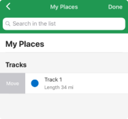
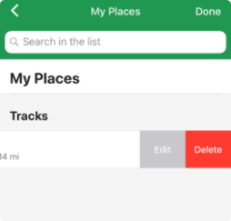

On Android, it’s not (yet) possible to move a track from one list to another.  
On the other hand, on iOS you can move one track from one list to another by opening the “Bookmarks and Tracks” list and slide to the right the track to move. A “Move” button will appear, as shown on the following figure. Once you click on the “Move” button, you can select the destination list for the track.

You can also slide to the left the tracks, where an “Edit” and “Delete” button will appear. If you click on “Edit”, you will also be able to change the list of the selected track.

