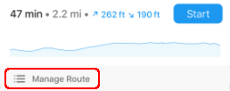
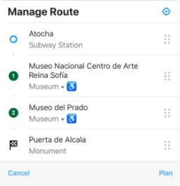

On iOS you can rearrange the order of the stops of the current route by clicking on the “Sort route” button located in the route plan panel:  
  
The “Manage Route” panel will pop-up, listing the starting and end point of the route as well as the different intermediate stops with their matching order number (1, 2, …). You can rearrange the order of the intermediate stops (as well as the starting and end point) by dragging the stop to move it to the desired position on the list:

After rearranging the stops in the list, click on the “Plan” button to make the changes effective in the current route plan.

This functionality of route stop sorting is not implemented (yet) on Android.
