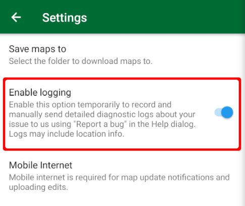
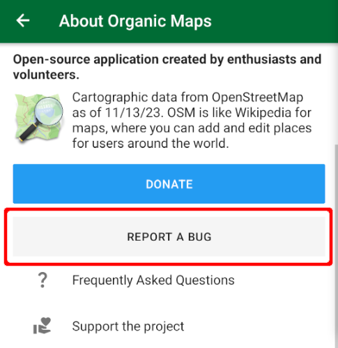

If you want to report a bug, then providing app logs in your report could help locate a problem faster. To get useful app logs, go to “Settings → Enable logging”. After that do action to reproduce the problem.

Finally tap on the button with the Organic Maps icon on the main screen and press the "Report a bug" button. Don't forget to disable logging after reporting.  

