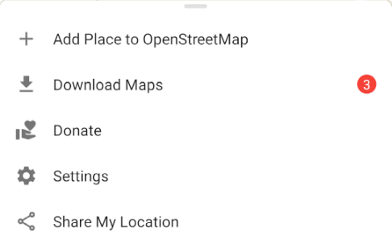

First, make sure that you have installed the updated app from [AppStore](https://apps.apple.com/app/organic-maps/id1567437057), [Google Play](https://play.google.com/store/apps/details?id=app.organicmaps&hl=en), [FDroid](https://f-droid.org/en/packages/app.organicmaps/), or [Huawei AppGallery](https://appgallery.huawei.com/#/app/C104325611?local=en). If the map data is outdated, you will see a red warning in the settings button of the main screen bottom menu:  

In that case, you can download the latest maps from the “Download Maps” menu.

