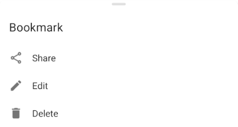

You can remove a bookmark or a track by opening the “Bookmark & tracks” list, long tapping on the bookmark or track to delete and by clicking on the “Delete” option of the pop-up menu:

Additionally, to delete a bookmark you can also select it on the map and click on the “Delete” button of the place information panel:

{{ image(src="image12.png" classes="max-w-50") }}
