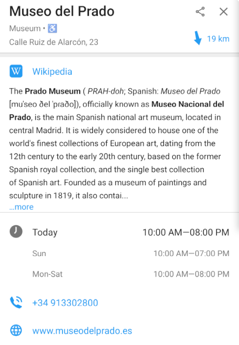

Tap or hold (long tap) on any object to see name, type (i.e. road type, forest type, etc.), address and all the available information details (those available in OpenStreetMap): related Wikipedia article, opening hours, phone number, website, etc.  

