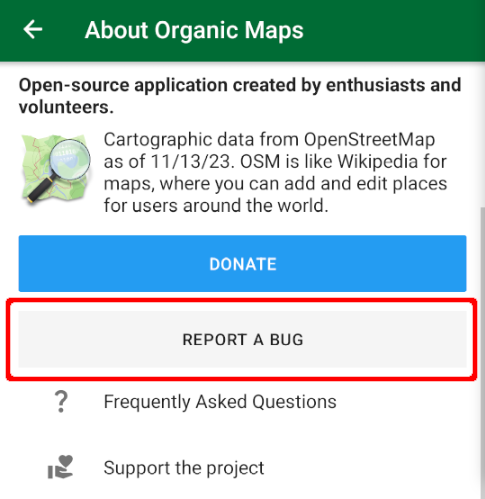

Report bugs or issues to [the issue tracker](https://github.com/organicmaps/organicmaps/issues) in Github or email us. You can submit feedback directly from the app just clicking on the green Organic Maps icon {{ image(src="image42.png" classes="img-inline") }} in the main menu. You'll find the "Report a bug" button there:  

