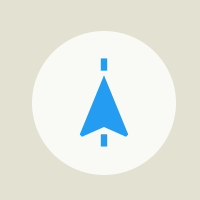

This icon shows the current GPS location status and the map rotation mode:  


| Icon | Meaning |
| :---: | :---- |
|  | Location search is not initiated. |
|  | App is looking for location. |
|  | Current position is found. Map is not centered in the current position. |
|  | Current position is found. Map is centered on the current position and oriented to the North. |
|  | Map is centered on the current position and rotates according to the device compass or vehicle direction. |

